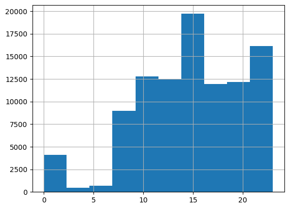
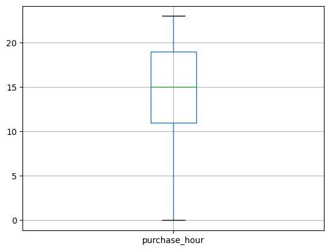

# E-commerce Data Quality Analysis

## Overview
This project analyzes the quality of an e-commerce orders dataset containing over 99,000 transactions.  
The goal was to evaluate data completeness, identify missing values, and determine appropriate data cleaning strategies.

## Tools Used
Python  
Pandas  
Matplotlib  
Google Colab

## Key Tasks
- Performed data profiling and data quality assessment
- Evaluated completeness and uniqueness of variables
- Analyzed missing value patterns
- Applied and compared imputation strategies
- Created visualizations to analyze purchase behavior

## Visualizations

### Purchase Hour Distribution

### Purchase Hour Boxplot

## Key Insight
Missing values were primarily associated with cancelled or incomplete orders rather than data entry errors.

## Author
Abiola Azeez  
Post-Baccalaureate Certificate in Data Analytics  
University of the Fraser Valley
